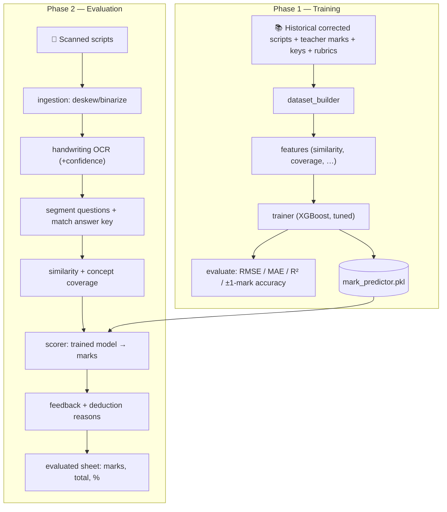

# 🛡️ ExamShield: Judge Pitch & Project Documentation Guide
> **Project Pitch:** *"Train ExamShield on a few previously corrected answer sheets, and it grades new handwritten scripts the way your teachers do — question-wise marks, feedback, and a percentage, in minutes."*

**Track:** 02 — Predictive Analytics (ML / DL)

---

## 🎯 1. The 30-Second Elevator Pitch
**Every semester, universities evaluate hundreds of thousands of handwritten answer booklets manually** — slow, inconsistent, and subjective. Different evaluators award different marks for the same answer; nothing captures *how teachers grade* so it can be reused.

**ExamShield** learns marking behaviour from previously corrected scripts and then **automatically evaluates** new handwritten scripts. It works in two phases:

1. **Phase 1 — Train:** on historical answers + teacher-awarded marks + answer keys + rubrics, we train a **mark-predictor** model.
2. **Phase 2 — Evaluate:** OCR a new script → detect each question → measure semantic similarity to the answer key → the trained model assigns **percentage-based marks** → generate feedback and deduction reasons → a fully evaluated sheet.

All **100% local and offline**. **The mark is the trained model's prediction — never an LLM's** (Track 02 prohibits LLM-generated predictions).

---

## 🛑 2. The Problem Space (Legacy vs. ExamShield)

| Legacy Manual Workflow | 🛡️ ExamShield Auto-Evaluator | Impact |
| :--- | :--- | :--- |
| **Inconsistent marking** — different evaluators/fatigue give different marks for equivalent answers. | Every answer scored by the **same trained model** learned from real teacher marking. | One consistent standard; measurable ±1-mark agreement. |
| **Slow** — a batch takes an office days. | OCR → segment → score → feedback in minutes. | **Days → minutes.** |
| **Opaque marks** — a bare number breeds revaluation disputes. | Every mark ships with feedback + explicit deduction reasons. | Fewer disputes; transparent grading. |
| **No institutional memory** — rubric knowledge lives in heads. | The trained model captures marking behaviour and reuses it. | Train once, grade every exam. |

---

## 🏗️ 3. System Architecture (two phases)

---

## ⚙️ 4. The Pipeline Stages

### 1️⃣ Phase-1 Training (the core innovation)
- **dataset_builder** pairs each historical answer with its key + the teacher's mark (label).
- **features** engineers: semantic similarity (MiniLM cosine), concept coverage, keyword recall,
  missing/extra points, length ratio, negation cues. *The same function runs at inference — no skew.*
- **trainer** fits + tunes an **XGBoost regressor** (feature importance for the bonus tag).
- **evaluate** reports **RMSE, MAE, R², and accuracy within ±1 mark** vs teacher marks on a held-out split.

### 2️⃣ Handwriting OCR + Segmentation
- Local handwriting OCR (TrOCR/PaddleOCR) reads answers + confidence; unreadable answers are flagged.
- The script is split into questions; each answer is matched to its answer key + rubric + max marks.

### 3️⃣ Semantic Similarity & Concept Coverage
- Embed answer vs key (all-MiniLM-L6-v2) → similarity + covered/missing key-points.
- Optional NLI cross-encoder catches **negation** ("is not exothermic" → contradiction, not coverage).

### 4️⃣ Scorer (assigns the marks)
- Builds the feature vector, runs the **trained model**, applies percentage bands (90–100%→full, …),
  clamps to `[0, max]`. **The mark comes from the model, never an LLM.**

### 5️⃣ Feedback & Report
- Feedback + deduction reasons from the coverage breakdown; assembles question-wise marks, total,
  percentage. Low-confidence answers flagged for human verification before publishing.

---

## 🛠️ 5. Technical Stack (offline, CPU, no LLM in the grading path)

- **Language:** Python 3.11 · **Backend:** FastAPI + Uvicorn.
- **Image prep:** OpenCV + pypdfium2. **Handwriting OCR:** TrOCR handwritten / PaddleOCR (local).
- **Semantic similarity:** `sentence-transformers` `all-MiniLM-L6-v2` (~80 MB, CPU).
- **Mark-predictor (trained):** **XGBoost** regressor (fallback RandomForest / sklearn MLP) + joblib.
- **Data/features:** NumPy, pandas, scikit-learn, rapidfuzz.
- **Storage:** local SQLite + JSON. **Frontend:** Next.js 14 + React + TypeScript + Recharts.

---

## 🎬 6. Live Demo Scenario

1. **THE HOOK (30s):** *"Two evaluators grade the same answer and give different marks. We trained a model on how your teachers actually grade — and it applies that standard to every script, consistently."*
2. **TRAINING PROOF:** show the **Training** dashboard — a model trained on the historical corpus with **RMSE and ±1-mark accuracy** vs teacher marks, plus feature importance.
3. **LIVE GRADING (judges are the data):** a judge handwrites an answer; photograph + upload with the answer key; run Phase 2 live.
4. **THE EVALUATED SHEET:** question-wise marks, total, percentage, and per-answer feedback + deduction reasons appear on screen.
5. **AGREEMENT + HONESTY:** compare a couple of predicted marks to a teacher's; show an unreadable answer flagged *"low confidence — verify"*. *"The mark is our trained model's prediction — never an LLM's."*

---

## 🛡️ 7. Q&A Defense Playbook

#### 💬 Q1: "Isn't this just prompting GPT to grade? That's banned in Track 02."
> *"No. The mark is produced by an **XGBoost regressor** we train on historical teacher marks. We can show you its RMSE and ±1-mark accuracy on held-out data. No LLM is in the grading path — at most an LLM phrases feedback text, never the mark."*

#### 💬 Q2: "Handwriting OCR is noisy — how do you trust the marks?"
> *"Scoring uses **semantic similarity**, which tolerates OCR wobble because it compares meaning, not exact characters. And if an answer's OCR confidence is too low, we flag it `low_confidence` for human verification before publishing — we never silently guess."*

#### 💬 Q3: "Two students phrase a correct answer differently — do they get the same mark?"
> *"Yes — we use sentence embeddings, not keyword matching, so differently-worded correct answers score similarly. Concept coverage checks rubric points, and NLI catches negation so a contradiction isn't counted as coverage."*

#### 💬 Q4: "What if you don't have historical teacher-marked data to train on?"
> *"Phase 2 runs on an **unsupervised similarity-to-key baseline** (map similarity % → marks). The trained model is the upgrade once labeled data exists — and it's what makes the grading match *your* teachers' standard."*

#### 💬 Q5: "How is this measurable (the Track-02 evaluation requirement)?"
> *"We report RMSE, MAE, R², and accuracy within ±1 mark of the teachers' marks on a held-out split — a real, numeric performance metric, not a vibe."*

---

### 📝 Project File Map (for the demo)
*   **Phase-1 Training:** [`backend/app/training/`](backend/app/training/)
*   **Evaluation (scorer/feedback/report):** [`backend/app/evaluation/`](backend/app/evaluation/)
*   **OCR + Segmentation:** [`backend/app/ocr/`](backend/app/ocr/), [`backend/app/segmentation/`](backend/app/segmentation/)
*   **FastAPI Routes:** [`backend/app/api/routes/`](backend/app/api/routes/)
*   **Dashboard:** [`frontend/src/app/`](frontend/src/app/)
*   **Setup:** [SETUP.md](SETUP.md) · **Full specs:** [docs/](docs/)
