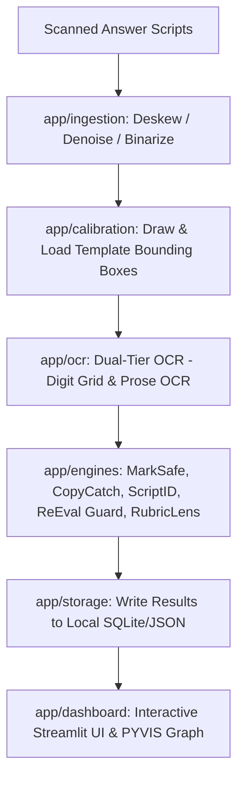

# ExamShield — Offline Handwritten Answer Sheet Evaluation Engine
> A local, CV-powered verification pipeline that caught totaling errors, maps collusion networks, and flags anomalies before results are published.

*Design / Planned — Not yet implemented*

---

## 1. Project Overview

ExamShield is a desktop-and-local-server assistant built to support **Controllers of Examinations (CoE)**, exam-cell staff, and paper evaluators. In typical academic semesters, grading physical, handwritten answer scripts is slow, error-prone, and vulnerable to student collusion. 

ExamShield addresses these pain points by offering a local pipeline that processes scanned scripts. It extracts markings, compares handwritten answers semantically, validates roll numbers against the class register, and highlights grading rubric alignments.

### Core Philosophy
> **"Rank and flag evidence; never accuse, never finalize; the human decides."**
> ExamShield never assigns grades and never makes accusations of cheating. It extracts and ranks anomalies, leaving final evaluation and disciplinary decisions strictly to human administrators.

---

## 2. Key Features

| Feature | Role / Purpose | Core Technology |
| :--- | :--- | :--- |
| **MarkSafe** | Trust layer: OCR-extracts marks grids and validates sum vs. written totals. | Digit OCR + OpenCV Ink-density |
| **CopyCatch** | Collusion graph: Finds copycat student pairs using semantic similarity. | Prose OCR + MiniLM Sentence Embeddings |
| **ScriptID** | Identity check: Matches roll numbers to register; flags absentees/duplicates. | Digit OCR + pandas registration validation |
| **ReEval Guard** | Triage queue: Preemptively identifies borderline scores (e.g., 39/40) for review. | Logic engine on MarkSafe output |
| **BlankCheck** | Basic audit: Automates page counting and attempted vs. blank triage. | OpenCV pixel profile analysis |
| **RubricLens** | Assistive grading: Semantically matches written text with rubrics. | Retrieval + NLI Cross-Encoder |

---

## 3. Planned Architecture & Pipeline Flow

The backend processes batches offline in a single sequential pipeline:



---

## 4. Planned Project Structure

```
E-Shield/
├── app/                      # Application source code
│   ├── ingestion/            # Script scanning, PDF rasterization, and image binarization
│   ├── calibration/          # Streamlit bounding-box canvas templates
│   ├── ocr/                  # Local PaddleOCR digitization and ambiguity fallbacks
│   ├── engines/              # Verification engines (MarkSafe, CopyCatch, etc.)
│   ├── dashboard/            # Review and collusion graphs UI
│   ├── storage/              # SQLite DB and JSON templates
│   ├── api.py                # FastAPI endpoints connecting pipeline & dashboard
│   └── README.md             # Subsystem integration overview
├── docs/                     # Technical specifications and planning papers
│   ├── engines/              # Detailed designs for each evaluation engine
│   └── ...
├── data/                     # Data directory (ignored in version control)
│   ├── corpus/               # Scanned script JPGs/PNGs
│   ├── templates/            # JSON calibration zones
│   └── register.csv          # Class roster csv
├── context.md                # Project background, goals, and glossary
├── plan.md                   # Build milestones (M0 - Mn)
├── implementation_plan.md    # Action items list per milestone
└── README.md                 # This file
```

---

## 5. Developer Quickstart (Planned)

### Prerequisites
* Python 3.11+
* OpenCV system dependencies (e.g., `libgl1` on Linux)
* Tesseract OCR binary (optional fallback for PaddleOCR)

### Setup Environment
1. Clone the repository and navigate to the project directory:
   ```bash
   git clone https://github.com/aishwaryaV007/E-Shield.git
   cd E-Shield
   ```
2. Create and activate a virtual environment:
   ```bash
   python -m venv .venv
   source .venv/bin/activate  # On Windows: .venv\Scripts\activate
   ```
3. Install dependencies:
   ```bash
   pip install --upgrade pip
   pip install -r requirements.txt
   ```

### Running the Calibration & Dashboard
* Start the FastAPI service:
   ```bash
   uvicorn app.api:app --reload --port 8000
   ```
* Run the Streamlit UI dashboard in a separate terminal:
   ```bash
   streamlit run app/dashboard/README.md  # Will point to streamlit entrypoint app/dashboard/main.py
   ```

---

## 6. Git Workflow & Development Guidelines

1. **Local-Only Dependencies:** Never add packages requiring GPU resources or paid cloud APIs. All libraries must run offline on a standard CPU.
2. **Branching Strategy:** Keep features isolated. Use descriptive branch names:
   * `feature/marksafe`
   * `feature/copycatch-embeddings`
   * `bugfix/ocr-strikeout-handling`
3. **Commit Messages:** Follow semantic commit guidelines (e.g., `feat: add CopyCatch clustering math`, `fix: handle blank marks columns in MarkSafe`).
4. **Preserve Comments:** Always retain inline architectural comments explaining OCR calibrations and threshold heuristics.
5. **No Blind Commit of Model Weights:** Ensure all model files downloaded by Hugging Face / PaddleOCR are cached in local folders outside the git index (e.g., standard `~/.cache`).

---

## 7. Related Documents

*   [Context and Scope](file:///Users/gaurav/Desktop/MyProjects/E-Shield/context.md)
*   [High-Level Build Plan](file:///Users/gaurav/Desktop/MyProjects/E-Shield/plan.md)
*   [Implementation Action Items](file:///Users/gaurav/Desktop/MyProjects/E-Shield/implementation_plan.md)
*   [Architecture Overview](file:///Users/gaurav/Desktop/MyProjects/E-Shield/docs/ARCHITECTURE.md)
