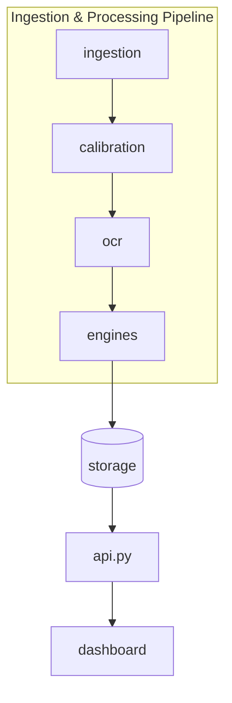

# ExamShield Application Core Module
> Architectural overview of the Python application codebase, demonstrating how backend pipelines, OCR endpoints, storage files, and dashboard systems connect.

*Design / Planned — Not yet implemented*

---

## 1. Subsystem Orchestration

The `app/` folder contains the Python source code for ExamShield. It operates as a local package designed around a unified pipeline:



*   **Ingestion (`app/ingestion/`):** Rasterizes input scripts, deskews, and filters images.
*   **Calibration (`app/calibration/`):** Visual GUI to align template layouts and output bounding-box files.
*   **OCR (`app/ocr/`):** OCR parser separating numbers (marks/ID) and text (prose).
*   **Engines (`app/engines/`):** Performs collusion calculations, summation audits, and grading checks.
*   **Storage (`app/storage/`):** Local SQLite DB storing results, configurations, and calibration templates.
*   **API (`app/api.py`):** FastAPI orchestration layer providing unified routes for the Streamlit dashboard.
*   **Dashboard (`app/dashboard/`):** Streamlit GUI displaying analysis data, crops, and NetworkX collusion graphs.

---

## 2. API Contract Entrypoints (Planned)

The integration between the dashboard interface and the verification modules is managed by the FastAPI server in `app/api.py`. Key API schemas include:

| Method | Endpoint | Payload / Query | Response | Purpose |
| :--- | :--- | :--- | :--- | :--- |
| **POST** | `/api/v1/batch/upload` | `files: list[UploadFile]` | `{"batch_id": "UUID", "status": "processing"}` | Scans scripts and writes them to local storage. |
| **POST** | `/api/v1/calibrate` | `TemplateJSON` | `{"status": "calibrated", "template_id": "UUID"}` | Saves page coordinate zones to the database. |
| **GET** | `/api/v1/batch/{id}/results` | None | `BatchResultSchema` | Retrieves audit results for MarkSafe and ScriptID. |
| **GET** | `/api/v1/batch/{id}/collusion` | `threshold: float` | `CollusionGraphJSON` | Generates node data for the CopyCatch visualization. |
| **POST** | `/api/v1/marks/override` | `MarksOverrideSchema` | `{"status": "updated"}` | Updates manual review overrides in the SQLite DB. |

---

## 3. Package Structure

```
app/
├── ingestion/            # Image load, deskew, and BlankCheck processing
│   ├── loader.py
│   ├── preprocess.py
│   └── README.md
├── calibration/          # Layout box coordination UI
│   ├── canvas.py
│   └── README.md
├── ocr/                  # Digit grids, prose extraction, and validation rules
│   ├── ocr_engine.py
│   ├── crop_extractor.py
│   └── README.md
├── engines/              # Verification engines (MarkSafe, CopyCatch, etc.)
│   ├── marksafe.py
│   ├── copycatch.py
│   ├── scriptid.py
│   ├── reeval_guard.py
│   ├── rubriclens.py
│   └── README.md
├── dashboard/            # Audit visualization interfaces
│   ├── main.py
│   ├── views.py
│   └── README.md
├── storage/              # SQLite definitions and migrations
│   ├── database.py
│   ├── schema.sql
│   └── README.md
├── api.py                # FastAPI endpoints launcher
└── README.md             # This file
```

---

## 4. Integration Guidelines

*   **Offline First:** Avoid importing external client libraries (e.g., `openai`, `google-cloud-vision`). Ensure all data flows through local modules.
*   **Graceful OCR Fallbacks:** If the text confidence score falls below `0.65`, route the result to `storage/` as `AMBIGUOUS`. This triggers a manual review flag in the dashboard rather than throwing an error.
*   **Performance Targets:** Processing 35 scripts should complete within 3 minutes on standard 4-core laptops. Optimize image operations via NumPy and avoid redundant OCR scans on uncalibrated zones.

---

## 5. Related Documents

*   [Overall README](file:///Users/gaurav/Desktop/MyProjects/E-Shield/README.md)
*   [In-Depth Architecture Spec](file:///Users/gaurav/Desktop/MyProjects/E-Shield/docs/ARCHITECTURE.md)
*   [Database Specification](file:///Users/gaurav/Desktop/MyProjects/E-Shield/app/storage/README.md)
