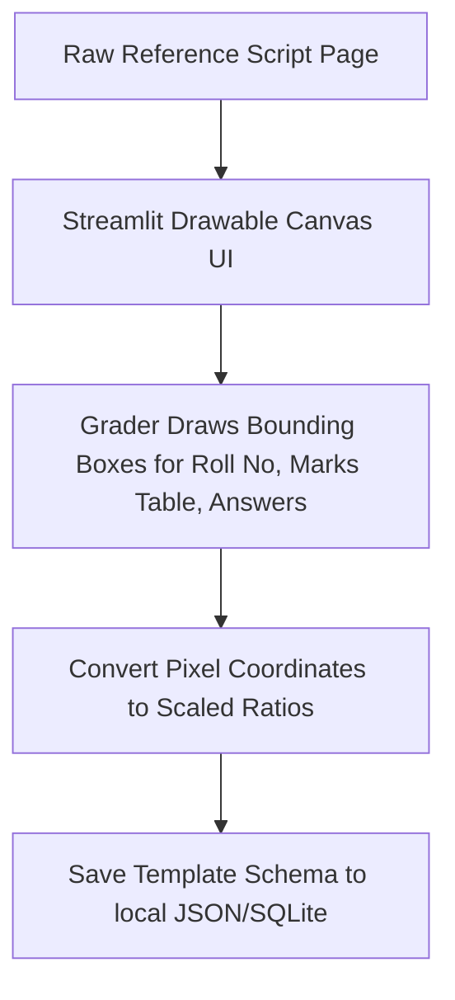

# ExamShield Calibration Module
> Specifications for layout mapping and visual zone coordinate calibration interfaces.

*Design / Planned — Not yet implemented*

---

## 1. Module Workflow

The calibration module maps coordinates for physical layouts. It provides exam-cell staff with a visual tool to register a new answer sheet format in under two minutes, saving coordinate zones to reusable JSON templates.



---

## 2. Technical Implementation

### Bounding-Box GUI (`canvas.py`)
Built using Streamlit and `streamlit-drawable-canvas`, this component loads a clean reference page image and lets administrators draw bounding box rectangles. The application scales the output coordinates so that varying scan resolutions do not disrupt the boundary mapping.

```python
# Planned implementation pattern
import streamlit as st
from streamlit_drawable_canvas import st_canvas
from PIL import Image

def calibration_page(image_path: str):
    st.title("ExamShield Layout Calibration")
    st.subheader("Draw bounding boxes for primary evaluation fields")
    
    img = Image.open(image_path)
    width, height = img.size
    
    # Scale image to fit the dashboard UI bounds
    ui_width = 800
    scale_factor = ui_width / width
    
    canvas_result = st_canvas(
        fill_color="rgba(255, 165, 0, 0.2)",
        stroke_width=2,
        stroke_color="#ff0000",
        background_image=img.resize((ui_width, int(height * scale_factor))),
        update_streamlit=True,
        height=int(height * scale_factor),
        width=ui_width,
        drawing_mode="rect",
        key="canvas",
    )
    
    # Convert points back to native image coordinates on save
```

### Template Coordinate Schema
Coordinates are stored as normalized scales `(x_ratio, y_ratio, w_ratio, h_ratio)` to support resolution changes across different scanners.

```json
{
  "template_name": "University_Final_Exam_2026",
  "native_width": 2480,
  "native_height": 3508,
  "zones": {
    "roll_number": {
      "page": 1,
      "coords": [0.15, 0.05, 0.50, 0.08]
    },
    "marks_table": {
      "page": 1,
      "coords": [0.80, 0.10, 0.15, 0.70]
    },
    "total_score_box": {
      "page": 1,
      "coords": [0.80, 0.85, 0.15, 0.10]
    },
    "prose_answers": [
      {
        "question_number": "Q1",
        "page": 2,
        "coords": [0.10, 0.10, 0.80, 0.35]
      },
      {
        "question_number": "Q2",
        "page": 2,
        "coords": [0.10, 0.50, 0.80, 0.40]
      }
    ]
  }
}
```

---

## 3. Related Documents

*   [Storage Structure Specification](file:///Users/gaurav/Desktop/MyProjects/E-Shield/app/storage/README.md)
*   [OCR Digits Pipeline](file:///Users/gaurav/Desktop/MyProjects/E-Shield/app/ocr/README.md)
*   [System Architecture Guide](file:///Users/gaurav/Desktop/MyProjects/E-Shield/docs/ARCHITECTURE.md)
