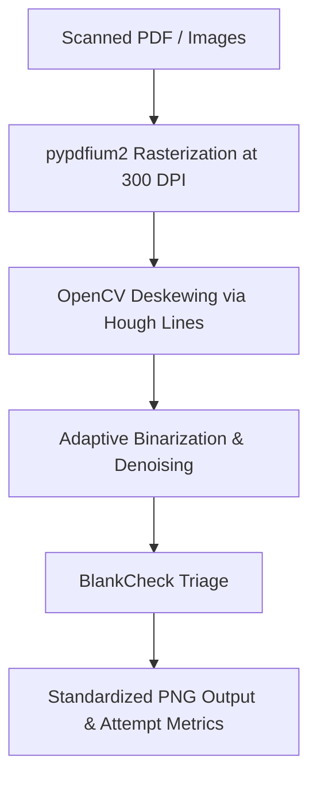

# ExamShield Ingestion Module
> Detailed design for raw input loading, image preprocessing, and initial script triage.

*Design / Planned — Not yet implemented*

---

## 1. Module Workflow

The ingestion module handles the raw boundaries of incoming answer scripts. It converts PDF assets into standardized, high-contrast image matrices ready for calibration mapping and OCR extraction.



---

## 2. Technical Implementation

### Image Preprocessing & Alignment (`preprocess.py`)
To prevent OCR alignment issues, every scanned sheet undergoes OpenCV deskewing and adaptive thresholding:

1.  **Deskewing:** The pipeline calculates the dominant angle of text lines using Hough Line Transform (`cv2.HoughLinesP`) or by extracting the minimal bounding box of foreground pixels via `cv2.minAreaRect`. The image is rotated via `cv2.warpAffine` using a cubic interpolation scheme.
2.  **Adaptive Thresholding:** High-contrast binarization separates handwritten pencil/ink strokes from background paper artifacts:
    ```python
    # Planned implementation pattern
    import cv2
    import numpy as np

    def preprocess_page(image_path: str) -> np.ndarray:
        # Load grayscale
        img = cv2.imread(image_path, cv2.IMREAD_GRAYSCALE)
        # Apply bilateral filter to remove noise while keeping handwriting edges clean
        denoised = cv2.bilateralFilter(img, 9, 75, 75)
        # Apply adaptive Gaussian binarization
        binary = cv2.adaptiveThreshold(
            denoised, 255, cv2.ADAPTIVE_THRESH_GAUSSIAN_C, 
            cv2.THRESH_BINARY_INV, 11, 2
        )
        return binary
    ```

### BlankCheck Triage (`loader.py`)
Before running expensive OCR models, a fast pixel-density scan evaluates each page:
*   **Ink-Presence Profile:** Checks the ratio of active foreground pixels (black pixels in the inverted binarized image) within designated text bounds.
*   **Empty Pages Alert:** If the ratio of foreground pixels on a page is `< 0.005`, the page is flagged as `BLANK`.
*   **Dispute Prevention Audit:** Compares the final page count against the register's logged sheet numbers to catch lost supplement pages early.

---

## 3. Configuration Parameters

```json
{
  "ingestion": {
    "target_dpi": 300,
    "max_skew_correction_angle": 15.0,
    "bilateral_filter": {
      "diameter": 9,
      "sigma_color": 75,
      "sigma_space": 75
    },
    "blank_check": {
      "ink_density_threshold": 0.005,
      "audit_flag_on_count_mismatch": true
    }
  }
}
```

---

## 4. Related Documents

*   [OCR Module Specifications](file:///Users/gaurav/Desktop/MyProjects/E-Shield/app/ocr/README.md)
*   [Overall Ingestion Plan](file:///Users/gaurav/Desktop/MyProjects/E-Shield/docs/PIPELINE_PLAN.md)
*   [BlankCheck Specifications](file:///Users/gaurav/Desktop/MyProjects/E-Shield/docs/engines/REEVAL_GUARD.md)
