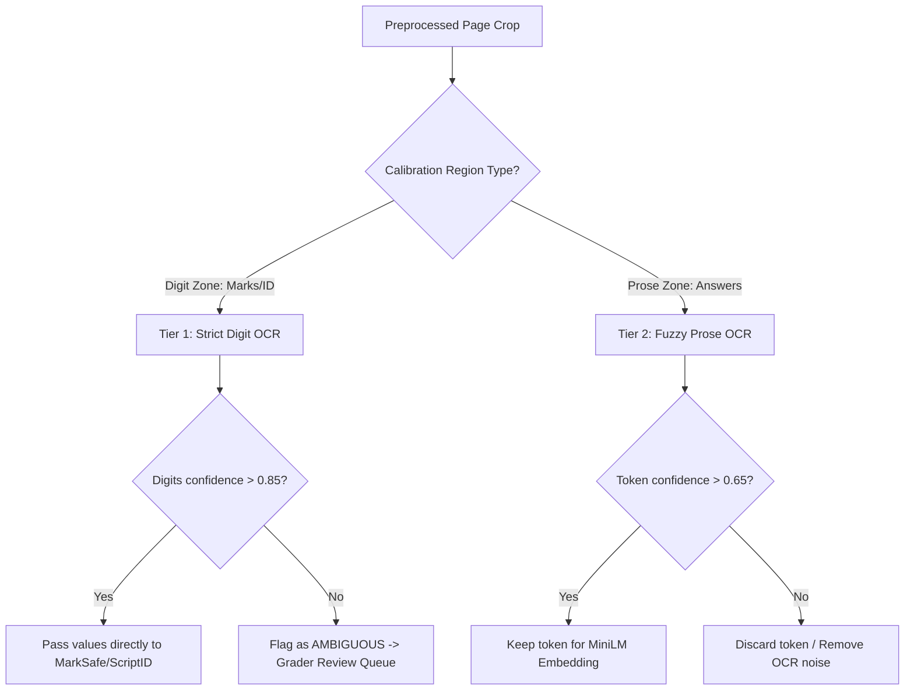

# ExamShield OCR Module
> Specifications for dual-tier local PaddleOCR processing pipelines, confidence extraction, and manual fallbacks.

*Design / Planned — Not yet implemented*

---

## 1. Dual-Tier Framework

ExamShield implements a two-tier OCR system to optimize extraction speed and accuracy:



*   **Tier 1 (Strict Digit OCR):** Applied to the marks column, written total boxes, and student roll numbers. It focuses exclusively on digits `0-9` and special markings (e.g., fractional delimiters `/`, `a+b` sub-marks). If any character falls below the target confidence threshold, it triggers an `AMBIGUOUS` state.
*   **Tier 2 (Fuzzy Prose OCR):** Applied to full handwritten answer paragraphs. It accommodates handwriting variance and spelling errors because the downstream semantic similarity matching (`all-MiniLM-L6-v2`) evaluates context rather than precise string alignment. Low-confidence words are discarded to reduce noise.

---

## 2. Technical Implementation

### OCR Engine Configuration (`ocr_engine.py`)
ExamShield uses a local execution of `PaddleOCR` to run text detection and recognition offline:

```python
# Planned implementation pattern
from paddleocr import PaddleOCR
import numpy as np

class LocalOCRPipeline:
    def __init__(self):
        # Initialize PaddleOCR locally using English weights
        self.ocr = PaddleOCR(use_angle_cls=True, lang="en", show_log=False)
        
    def extract_digits(self, image_crop: np.ndarray) -> tuple[str, float]:
        # Run OCR with numeric classification filters
        result = self.ocr.ocr(image_crop, cls=True)
        if not result or not result[0]:
            return "", 0.0
        
        parsed_digits = []
        confidence_scores = []
        
        for line in result[0]:
            text, conf = line[1]
            # Strip non-numeric/fraction characters
            cleaned = "".join([c for c in text if c.isdigit() or c in "/.+"])
            parsed_digits.append(cleaned)
            confidence_scores.append(conf)
            
        avg_confidence = sum(confidence_scores) / len(confidence_scores) if confidence_scores else 0.0
        return "".join(parsed_digits), avg_confidence
```

### Ambiguity Flag Fallback
When digit validation encounters strikeouts, overwrites, or low-confidence predictions:
1.  The system bypasses automated parsing.
2.  It logs the exception code `ERR_OCR_LOW_CONFIDENCE` or `ERR_MATH_CONTRADICTION` in SQLite.
3.  The coordinates are stored to highlight the original image snippet in the dashboard review panel.
4.  The value remains `NULL` until a human manually overrides the mark.

---

## 3. Configuration Variables

```json
{
  "ocr": {
    "engine": "PaddleOCR",
    "digit_mode": {
      "confidence_threshold": 0.85,
      "whitelist": "0123456789/.+"
    },
    "prose_mode": {
      "confidence_threshold": 0.65,
      "stop_words_removal": true
    }
  }
}
```

---

## 4. Related Documents

*   [MarkSafe Verification Engine Specifications](file:///Users/gaurav/Desktop/MyProjects/E-Shield/docs/engines/MARKSAFE.md)
*   [CopyCatch Plagiarism Engine Specifications](file:///Users/gaurav/Desktop/MyProjects/E-Shield/docs/engines/COPYCATCH.md)
*   [OCR Implementation Milestones](file:///Users/gaurav/Desktop/MyProjects/E-Shield/docs/OCR_PLAN.md)
