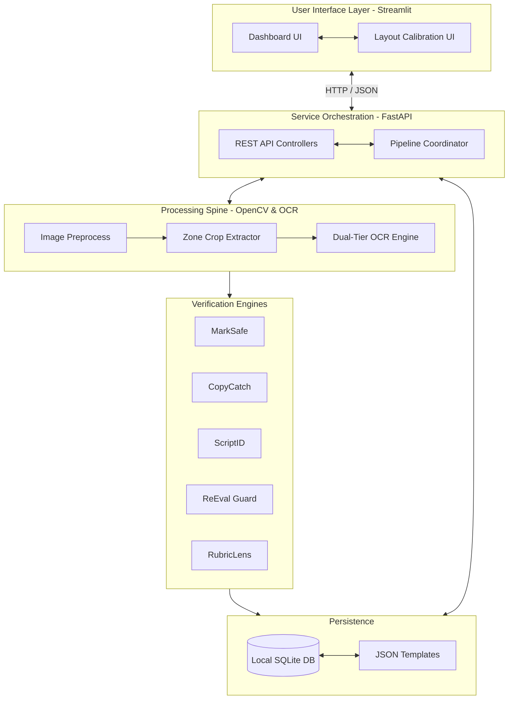

# ExamShield Architecture Specification
> High-level architectural pattern, processing lifecycle, and component separation schemas.

*Design / Planned — Not yet implemented*

---

## 1. Architectural Strategy

ExamShield is structured around a **Local Modular Pipeline** design. The application runs entirely on the host machine to meet strict privacy constraints and ensure reliable performance without internet dependencies.

*   **Offline Sandboxing:** No external cloud processing. AI inference and OCR text extraction use lightweight CPU models that run locally.
*   **Decoupled Frontend/Backend:** The Streamlit user interface communicates with the FastAPI service layer via standard REST calls. This structure allows the core execution engine to run as a CLI tool or integration script if needed.
*   **Coordinate-Based Routing:** An answer sheet binarized by OpenCV is cropped into zones based on a calibration profile, allowing target OCR engines to scan only specified regions.

---

## 2. Ingestion to Verification Lifecycle

When a user processes a new batch of answer sheets, the request executes sequentially through these stages:

1.  **Ingestion & Binarization:** Scanned physical papers (PNG, JPG, or PDF) are rasterized at 300 DPI, deskewed, and binarized using adaptive thresholding.
2.  **Calibration Alignment:** The system matches pages with a selected zone calibration template. If coordinates are missing, it prompts the user to calibrate the layout.
3.  **Region Extraction & OCR:** Bounding boxes are cropped. The system routes marks column and roll number zones to the Tier-1 Digit OCR, while answer regions are sent to the Tier-2 Prose OCR.
4.  **Engine Analysis:**
    *   **MarkSafe** validates column sums against written overall totals.
    *   **CopyCatch** vectorizes prose and computes pairwise similarity clusters.
    *   **ScriptID** validates roll numbers against the student roster database.
    *   **ReEval Guard** filters borderline scores.
    *   **RubricLens** extracts rubric evidence.
5.  **Persistence & Audit Flags:** The system writes all extraction metrics to the local SQLite database. Flagged anomalies remain in a `PENDING` review state.
6.  **Human Resolution:** The Controller of Examinations reviews flags in the dashboard, inputting overrides to resolve discrepancies before finalizing grades.

---

## 3. Key Design Patterns

*   **Pipeline Pattern:** Sequential filters process images and text, passing clean data structures downstream.
*   **Repository Pattern:** A data access layer isolates engine evaluations from raw SQL execution queries.
*   **Strategy Pattern (OCR):** The system dynamically switches between digit-specific recognition and prose classification configurations depending on the target region.
*   **Observer Pattern (Dashboard):** Streamlit views react dynamically as background threads resolve database records.

---

## 4. Related Documents

*   [Technology Stack Justifications](file:///Users/gaurav/Desktop/MyProjects/E-Shield/docs/TECH_STACK.md)
*   [Data Flow and State Transitions](file:///Users/gaurav/Desktop/MyProjects/E-Shield/docs/DATA_FLOW.md)
*   [API Contracts Spec](file:///Users/gaurav/Desktop/MyProjects/E-Shield/docs/API_CONTRACT.md)
