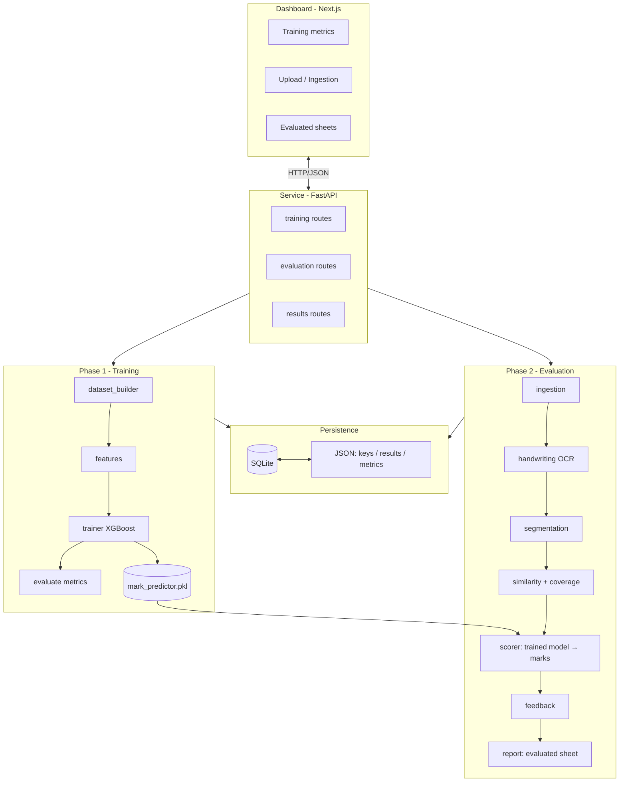

# ExamShield Architecture Specification
> High-level architecture, the two-phase lifecycle, and component separation.

*Design / Planned — Not yet implemented*

---

## 1. Architectural Strategy

ExamShield is a **local, two-phase ML pipeline** with a decoupled web dashboard. Everything runs on
the host machine for privacy and offline reliability. **The mark is produced by a trained model,
never an LLM.**

- **Offline sandboxing:** local CPU models only; no cloud, no LLM in the grading path.
- **Decoupled frontend/backend:** Next.js talks to FastAPI over REST; the pipeline can also run as a CLI.
- **Train once, grade many:** Phase 1 produces a reusable model artifact that Phase 2 loads.

---

## 2. Two-Phase Lifecycle

### Phase 1 — Training (offline, run when historical data changes)
1. **Build dataset:** pair historical answers with keys + teacher marks (labels).
2. **Engineer features:** similarity, concept coverage, keyword recall, etc.
3. **Train:** fit + tune the XGBoost regressor; save the artifact.
4. **Evaluate:** RMSE / MAE / R² / ±1-mark accuracy on a held-out split.

### Phase 2 — Evaluation (per uploaded batch)
1. **Ingest & binarize** scanned scripts (OpenCV, pypdfium2).
2. **OCR** the handwriting + confidence.
3. **Segment** into questions; match each answer to its key + rubric.
4. **Score:** similarity + coverage → feature vector → **trained model** → marks (percentage bands).
5. **Feedback + report:** deduction reasons; question-wise marks, total, percentage.
6. **Persist:** evaluated sheets in SQLite/JSON; the API serves them; low-confidence answers flagged.

---

## 3. Key Design Patterns

- **Pipeline pattern:** sequential stages pass clean data structures downstream (both phases).
- **Repository pattern:** the storage layer isolates evaluation records from raw SQL.
- **Shared-feature contract:** one feature function for train + inference (no skew).
- **Strategy (OCR):** handwriting recognition is swappable (TrOCR / PaddleOCR).

---

## 4. Related Documents

*   [Technology Stack](file:///Users/gaurav/Desktop/MyProjects/E-Shield/docs/TECH_STACK.md)
*   [Data Flow](file:///Users/gaurav/Desktop/MyProjects/E-Shield/docs/DATA_FLOW.md)
*   [API Contract](file:///Users/gaurav/Desktop/MyProjects/E-Shield/docs/API_CONTRACT.md)
