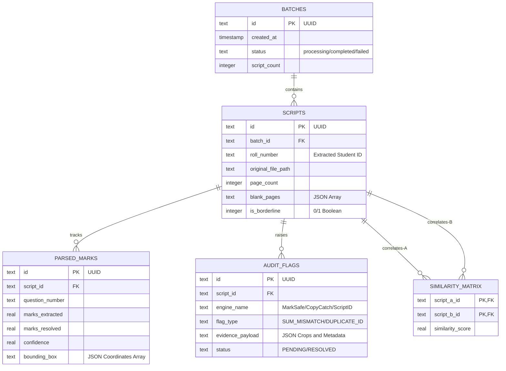

# ExamShield Database Design Spec
> SQLite database schema definitions, entity-relationship structures, primary indexing paths, and transaction rules.

*Design / Planned — Not yet implemented*

---

## 1. Database Paradigm

ExamShield uses a local serverless database architecture via **SQLite**. This ensures portability, zero runtime installation overhead, and fast read/write times on standard local storage drives during hackathons and university examinations.

---

## 2. Entity-Relationship Schema

The database schema isolates transactional batch runs from static coordination templates and auditing alerts:



---

## 3. Database Table Specifications

### 1. `batches` Table
Tracks ingestion pipeline status.
*   `id`: `TEXT` Primary Key (UUIDv4 format).
*   `status`: `TEXT` NOT NULL. Constrained to `processing`, `completed`, `failed`.
*   `script_count`: `INTEGER` NOT NULL.

### 2. `scripts` Table
Holds metadata for each scanned booklet.
*   `id`: `TEXT` Primary Key (UUIDv4 format).
*   `batch_id`: `TEXT` REFERENCES `batches(id)` ON DELETE CASCADE.
*   `roll_number`: `TEXT` (nullable to handle OCR failures or unregistered booklets).
*   `is_borderline`: `INTEGER` DEFAULT `0` (used by ReEval Guard for quick filtering).

### 3. `parsed_marks` Table
Stores extracted question-wise scores and manual overrides.
*   `id`: `TEXT` Primary Key.
*   `script_id`: `TEXT` REFERENCES `scripts(id)` ON DELETE CASCADE.
*   `marks_extracted`: `REAL` (nullable to allow for blank or unreadable cells).
*   `marks_resolved`: `REAL` (contains the human auditor override value).

---

## 4. Performance Indexes

To maintain responsive query performance on large batches (e.g., $O(N^2)$ comparisons across hundreds of scripts):

```sql
-- Index optimization queries
-- Speed up script queries during batch runs
CREATE INDEX IF NOT EXISTS idx_scripts_batch ON scripts(batch_id);

-- Speed up roll number validation runs
CREATE INDEX IF NOT EXISTS idx_scripts_roll ON scripts(roll_number);

-- Speed up marks aggregation calculations
CREATE INDEX IF NOT EXISTS idx_marks_script ON parsed_marks(script_id);

-- Speed up dashboard alert views
CREATE INDEX IF NOT EXISTS idx_flags_status ON audit_flags(status);

-- Speed up collusion graph renders
CREATE INDEX IF NOT EXISTS idx_similarity_lookup ON similarity_matrix(script_a_id, script_b_id);
```

---

## 5. Related Documents

*   [Database Concepts](file:///Users/gaurav/Desktop/MyProjects/E-Shield/docs/DBMS_CONCEPTS.md)
*   [Storage Module Specs](file:///Users/gaurav/Desktop/MyProjects/E-Shield/app/storage/README.md)
*   [Scalability Analysis](file:///Users/gaurav/Desktop/MyProjects/E-Shield/docs/SCALABILITY.md)
