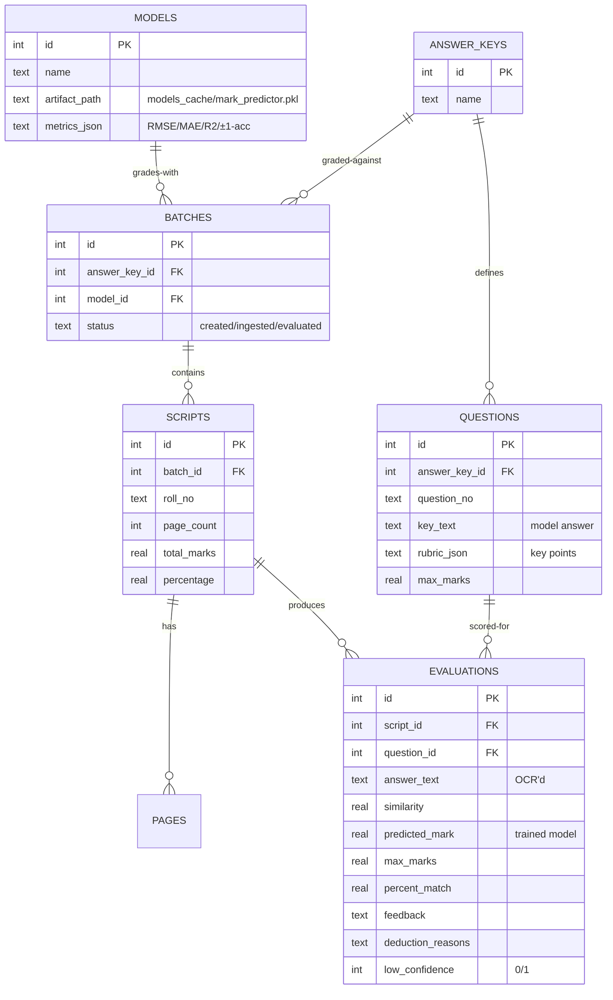

# ExamShield Database Design Spec
> SQLite schema, entity relationships, and indexing for the auto-grader.

*Design / Planned — Not yet implemented*

---

## 1. Database Paradigm

Local, serverless **SQLite** — portable, zero-install, fast on local storage. The authoritative
schema lives in [`backend/app/storage/schema.sql`](file:///Users/gaurav/Desktop/MyProjects/E-Shield/backend/app/storage/schema.sql).

---

## 2. Entity-Relationship Schema



---

## 3. Key Tables

- **`models`** — registry of trained mark-predictors + their metrics (Phase 1 output).
- **`answer_keys` / `questions`** — the question paper, model answers, rubric points, and max marks.
- **`batches` / `scripts` / `pages`** — the uploaded scripts to grade.
- **`evaluations`** — the core auto-grader output: one row per (script, question) with the
  **predicted mark**, similarity, feedback, deduction reasons, and a low-confidence flag.

---

## 4. Indexes

```sql
CREATE INDEX IF NOT EXISTS idx_scripts_batch   ON scripts(batch_id);
CREATE INDEX IF NOT EXISTS idx_questions_key   ON questions(answer_key_id);
CREATE INDEX IF NOT EXISTS idx_evals_script    ON evaluations(script_id);
CREATE INDEX IF NOT EXISTS idx_evals_question  ON evaluations(question_id);
CREATE INDEX IF NOT EXISTS idx_pages_script    ON pages(script_id);
```

---

## 5. Related Documents

*   [DBMS Concepts](file:///Users/gaurav/Desktop/MyProjects/E-Shield/docs/DBMS_CONCEPTS.md)
*   [Storage module](file:///Users/gaurav/Desktop/MyProjects/E-Shield/backend/app/storage/README.md)
*   [Data Flow](file:///Users/gaurav/Desktop/MyProjects/E-Shield/docs/DATA_FLOW.md)
