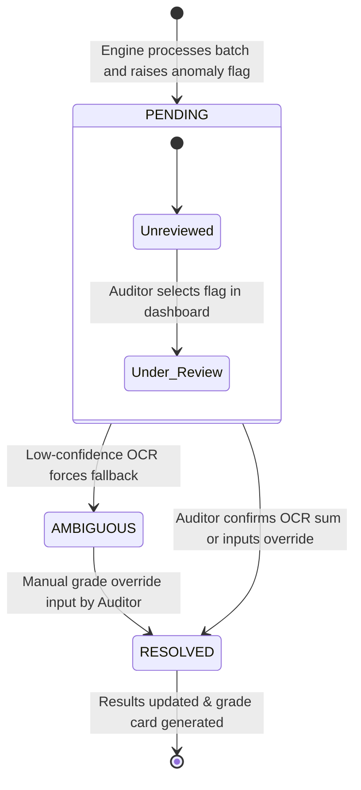

# ExamShield Data Flow & State Transitions
> Data transformation pipeline, input image processing, vector state calculations, and manual database override states.

*Design / Planned — Not yet implemented*

---

## 1. Data Transformation Overview

The data flow pipeline transforms physical handwritten documents into validated database records through sequential image processing and natural language modeling stages:

```
[Raw Physical Booklet] 
      │ 
      ▼ (pypdfium2 Rasterization at 300 DPI)
[Raw Page Image Matrix (RGB)] 
      │ 
      ▼ (OpenCV Bilateral Filter & Gaussian Adaptive Binarization)
[High-Contrast Binary Image Matrix (0/255)] 
      │ 
      ▼ (Template coordinates crop splits)
  ┌───┴──────────────────────────────────────────┐
  │                                              │
  ▼ (Zone: Marks Table / ID)                     ▼ (Zone: Written answers)
[Digit Bounding Box Crops]                     [Prose Bounding Box Crops]
  │                                              │
  ▼ (Tier-1 OCR)                                 ▼ (Tier-2 OCR)
[Digit Tokens + Confidence]                     [Prose Tokens + Confidence]
  │                                              │
  ▼ (MarkSafe / ScriptID logic)                  ▼ (all-MiniLM-L6-v2 Embeddings)
[Calculated Sums & Match States]               [384-Dimensional Vectors]
  │                                              │
  │                                              ▼ (Pairwise Cosine calculations)
  │                                            [Similarity Matrix Rows]
  │                                              │
  └──────────────────────┬───────────────────────┘
                         │
                         ▼ (State logic evaluations)
                  [SQLite database Records]
                         │
                         ▼ (Auditor manual overrides)
                  [Final Result CSV / Archive]
```

---

## 2. Component Data Formats

### 1. Ingestion Output
*   **Source:** Raw scan files.
*   **Format:** Binarized PNG file matrix.
*   **Metadata:** Page count, image dimensions `(W, H)`, file size.

### 2. Digit Zone Extraction
*   **Source:** Marks column crop, written total box crop, roll number box crop.
*   **Format:** Numeric string arrays and confidence scores:
    ```python
    {
      "roll_number": {"text": "26SN101012", "confidence": 0.94},
      "marks_column": [
        {"question": "Q1.a", "text": "5", "confidence": 0.98},
        {"question": "Q1.b", "text": "4", "confidence": 0.89},
        {"question": "Q2.a", "text": "10", "confidence": 0.91}
      ],
      "written_total": {"text": "19", "confidence": 0.96}
    }
    ```

### 3. Prose Vector Representation
*   **Source:** Hand-written student answer crops.
*   **Format:** Cosine similarity vectors:
    ```python
    {
      "script_id": "s22a8c9e",
      "question_number": "Q2",
      "tokens_extracted": "The process is exothermic because heat is released during the reaction...",
      "vector_embedding": [0.045, -0.012, 0.128, ..., 0.009]  # 384-dimensions
    }
    ```

---

## 3. Audit Flag State Transitions

Discrepancies identified during engine processing transition through states as human graders audit and resolve them:



*   **PENDING:** Default state for any validation discrepancies flagged by the engine (e.g., MarkSafe sum mismatches).
*   **AMBIGUOUS:** Triggered when the digit OCR confidence falls below `0.85`, indicating bad handwriting or strikeouts.
*   **RESOLVED:** The finalized state. This is set when an auditor manually confirms the marks value in the Streamlit panel, updating the record in SQLite.

---

## 4. Related Documents

*   [Overall Architecture Spec](file:///Users/gaurav/Desktop/MyProjects/E-Shield/docs/ARCHITECTURE.md)
*   [Database Design Document](file:///Users/gaurav/Desktop/MyProjects/E-Shield/docs/DATABASE_DESIGN.md)
*   [MarkSafe Specifications](file:///Users/gaurav/Desktop/MyProjects/E-Shield/docs/engines/MARKSAFE.md)
