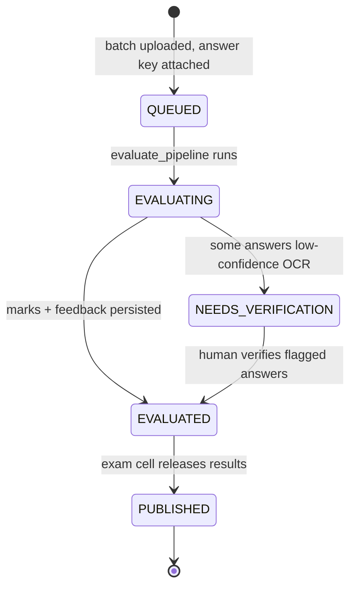

# ExamShield Data Flow & State Transitions
> How data moves through both phases, and the states an evaluation passes through.

*Design / Planned — Not yet implemented*

---

## 1. Phase 1 — Training data flow

```
[Historical corrected scripts + teacher marks + answer keys + rubrics]
      │  (dataset_builder)
      ▼
[Labeled table: one row per (student_answer, answer_key, teacher_mark)]
      │  (features: similarity, concept coverage, keyword recall, length ratio, …)
      ▼
[Feature matrix X + label vector y]
      │  (trainer: XGBoost regressor, tuned)
      ▼
[mark_predictor.pkl]  ──(evaluate)──►  [metrics: RMSE / MAE / R² / ±1-mark accuracy]
```

## 2. Phase 2 — Evaluation data flow

```
[Raw scanned booklet (PDF/JPG)]
      │  (pypdfium2 → OpenCV deskew/denoise/binarize)
      ▼
[Clean page images]
      │  (handwriting OCR + confidence)
      ▼
[Per-answer text + confidence]
      │  (segmentation: split questions, match answer key + rubric)
      ▼
[Grading units: (student_answer, answer_key, rubric, max_marks)]
      │  (similarity + concept coverage → same feature vector as training)
      ▼
[Feature vector per answer]
      │  (scorer: trained model → predicted mark, percentage bands, clamp[0,max])
      ▼
[Per-question marks]  ──(feedback)──►  [deduction reasons + feedback]
      │  (report)
      ▼
[Evaluated sheet: question-wise marks, total, percentage]  →  SQLite / JSON
```

---

## 3. Per-answer record format

```python
{
  "script_id": "s22a8c9e",
  "question_no": "Q2",
  "answer_text": "The process is exothermic because heat is released...",
  "similarity": 0.86,          # semantic similarity to the answer key
  "predicted_mark": 6.5,       # from the trained model
  "max_marks": 8,
  "percent_match": 0.82,
  "feedback": "Covers the exothermic definition and heat release; misses activation energy.",
  "deduction_reasons": ["missing: activation energy"],
  "low_confidence": 0          # 1 => OCR unreadable, verify before publishing
}
```

---

## 4. Evaluation state transitions



- **NEEDS_VERIFICATION:** an answer's OCR confidence fell below threshold — flagged for a human,
  never guessed. The mark itself always comes from the trained model.

---

## 5. Related Documents

*   [Architecture](file:///Users/gaurav/Desktop/MyProjects/E-Shield/docs/ARCHITECTURE.md)
*   [Database Design](file:///Users/gaurav/Desktop/MyProjects/E-Shield/docs/DATABASE_DESIGN.md)
*   [Scorer stage](file:///Users/gaurav/Desktop/MyProjects/E-Shield/docs/stages/SCORER.md)

## To-Do List

- [x] Implement ingestion data flow
- [ ] Implement evaluation data flow
- [ ] Review document for technical accuracy against current implementation.
- [ ] Ensure all referenced internal links are valid and working.
- [ ] Add architectural or workflow diagrams where applicable.
- [ ] Proofread for grammar, consistency, and tone.
- [ ] Cross-reference with SYSTEM_DESIGN.md for alignment.
- [ ] Verify that security considerations are documented if relevant.
- [ ] Add examples or code snippets to clarify complex sections.
- [ ] Check formatting (headers, bolding, lists) for readability.
