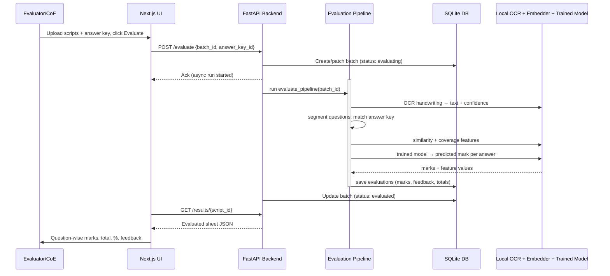

# ExamShield System Design
> Subsystem interaction, execution model, and caching for the two-phase auto-grader.

---

## 1. Subsystem Interaction (Phase 2 evaluation)

Phase 1 (training) runs the analogous flow: `POST /train` → `train_pipeline` →
dataset_builder → features → trainer → evaluate → persist model + metrics → `GET /train/metrics`.

---

## 2. Execution Model

- **Async API:** FastAPI `async def`; pipelines run as background tasks so the dashboard can poll status.
- **Sequential AI inference:** OCR, embeddings, and model prediction run single-threaded to avoid
  CPU/RAM contention on 8 GB laptops. Image preprocessing may use a small thread pool.
- **Training is a batch job:** Phase 1 runs offline and writes one model artifact; Phase 2 only
  *loads* it (fast, cached).

---

## 3. Caching & Files

- **Model weights:** MiniLM + OCR cached under `models_cache/` and default HF/Paddle caches.
- **Trained mark-predictor:** `models_cache/mark_predictor.pkl` (loaded once, cached in-process).
- **Scanned images:** `data/raw/{batch_id}/{script_id}/page_{n}.png`.
- **Outputs:** evaluated sheets in `data/results/`, training metrics in `data/metrics/`, answer keys
  in `data/answer_keys/`.
- **DB writes:** thread-safe SQLite connection; evaluations queued to avoid locks.

---

## 4. Subsystem Components

1. **Training (`app/training/`)** — dataset_builder, features, trainer (XGBoost), evaluate. Output:
   trained model + metrics.
2. **Ingestion + OCR (`app/ingestion/`, `app/ocr/`)** — PDF→image, deskew/binarize, handwriting
   recognition + confidence.
3. **Segmentation (`app/segmentation/`)** — question splitting + answer-key matching.
4. **Evaluation (`app/evaluation/`)** — similarity, concept_coverage, scorer (trained model),
   feedback, report. Output: evaluated sheets.
5. **Interface (`frontend/`)** — Training metrics, upload, and evaluated-sheet views.

---

## 5. Related Documents

*   [Scalability](file:///Users/gaurav/Desktop/MyProjects/E-Shield/docs/SCALABILITY.md)
*   [Data Flow](file:///Users/gaurav/Desktop/MyProjects/E-Shield/docs/DATA_FLOW.md)
*   [Database Design](file:///Users/gaurav/Desktop/MyProjects/E-Shield/docs/DATABASE_DESIGN.md)

## To-Do List

- [x] Draft initial system architecture
- [ ] Refine API gateways and load balancers
- [ ] Review document for technical accuracy against current implementation.
- [ ] Ensure all referenced internal links are valid and working.
- [ ] Add architectural or workflow diagrams where applicable.
- [ ] Proofread for grammar, consistency, and tone.
- [ ] Cross-reference with SYSTEM_DESIGN.md for alignment.
- [ ] Verify that security considerations are documented if relevant.
- [ ] Add examples or code snippets to clarify complex sections.
- [ ] Check formatting (headers, bolding, lists) for readability.
