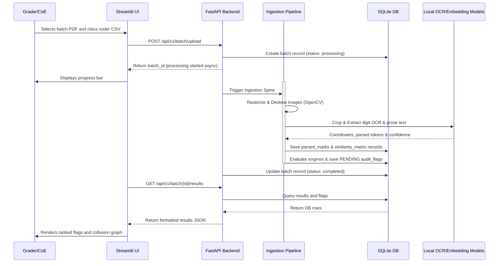

# ExamShield System Design
> System architecture, modular subsystems interaction, data caching strategy, and local process threading models.

*Design / Planned — Not yet implemented*

---

## 1. Subsystem Interaction Model

ExamShield operates as a local application that decouples visual dashboard interfaces from the core evaluation engines. This allows for background processing and helps prevent Streamlit UI freezes during high-compute OCR steps.

---

## 2. Process Threading & Execution Model

To run efficiently on standard university laptops, the system coordinates concurrency using Python's `asyncio` and thread workers:

*   **Ingestion Concurrency:** Image pre-processing (deskewing, binarizing, page counting) uses a thread pool (`concurrent.futures.ThreadPoolExecutor`) to run parallel processes on multiple CPU cores.
*   **Sequential AI Inference:** Local AI model invocations (PaddleOCR extraction and sentence vector embeddings) run sequentially on a single thread. This prevents CPU core congestion and memory paging errors on machines with limited RAM (e.g., 8 GB).
*   **Non-Blocking API Calls:** FastAPI handles requests asynchronously using `async def`, allowing the dashboard to query processing logs while the pipeline runs in the background.

---

## 3. Local Cache & Workspace File Management

To optimize performance and avoid re-processing scanned files:

*   **Scanned Image Storage:** Rasterized pages are stored locally in `/data/corpus/{batch_id}/{script_id}/page_{n}.png`. Bounding box evidence crops are generated dynamically and cached in memory.
*   **Model Weights Caching:** PaddleOCR and Hugging Face weights are cached in default system folders (`~/.cache/paddleocr/` and `~/.cache/huggingface/`).
*   **Database Writes:** SQL writes are managed using a thread-safe connection pool, queuing transactions to prevent database locks on SQLite.

---

## 4. Subsystem Components Specification

### 1. Ingestion Subsystem (`app/ingestion/`)
*   **Components:** `pypdfium2` for PDF loading, OpenCV for deskewing and denoising, and `BlankCheck` pixel validation.
*   **Outputs:** Standardized, high-contrast binarized PNGs.

### 2. OCR Subsystem (`app/ocr/`)
*   **Components:** Local PaddleOCR pipeline, bounding box crop managers, and digit classification filters.
*   **Outputs:** Numeric mark extraction records and raw prose text logs.

### 3. Engines Subsystem (`app/engines/`)
*   **Components:** MarkSafe logic engine, CopyCatch cosine calculations, ScriptID register matching, and ReEval Guard border sorting.
*   **Outputs:** Structured anomaly records saved to the database.

### 4. Interface Subsystem (`app/dashboard/`)
*   **Components:** Streamlit server, drawable alignment canvas, NetworkX graph plotting modules, and manual override fields.
*   **Outputs:** Interactive result dashboards and exportable final grading sheets.

---

## 5. Related Documents

*   [System Scalability Spec](file:///Users/gaurav/Desktop/MyProjects/E-Shield/docs/SCALABILITY.md)
*   [Data Flow and State Transitions](file:///Users/gaurav/Desktop/MyProjects/E-Shield/docs/DATA_FLOW.md)
*   [Database Design Document](file:///Users/gaurav/Desktop/MyProjects/E-Shield/docs/DATABASE_DESIGN.md)
